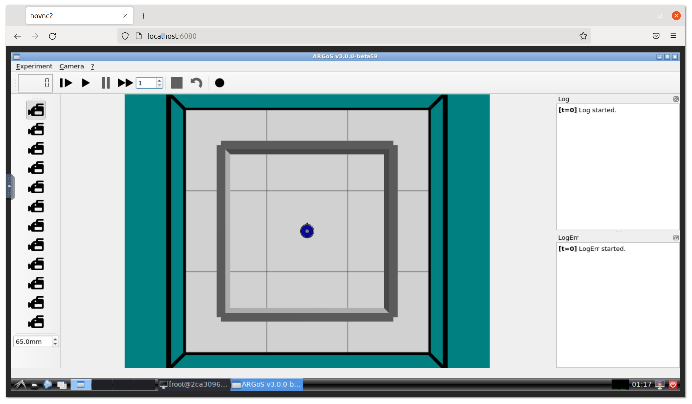

# ARGoS in Docker
[](https://github.com/tylerferrara/argos3-docker/blob/master/LICENSE)


> Portable robot simulation environment, using [ARGoS](https://github.com/ilpincy/argos3). Built within docker containers & displayed via browser-based VNC (noVNC), ARGoS should now be accessable on **all platforms**.

## Usage
```bash
$ docker run -p 6080:80 -v /dev/shm:/dev/shm tjferrara/argos3:latest
```

Visit http://localhost:6080 on your browser of choice, to display the GUI.


 ___

### [ Optional ] Customization 
```bash
$ docker run \
    -e USER=doro \                  # Create a new user
    -e PASSWORD=password \          # Password for new user
    -e RESOLUTION=1920x1080 \       # Resolution of VNC
    -e HTTP_PASSWORD=mypassword \   # Password for VNC
    -p 6080:80 -v /dev/shm:/dev/shm tjferrara/argos3:latest
```
These options are given by the base image `dorowu/ubuntu-desktop-lxde-vnc`.
For more customization information, visit https://hub.docker.com/r/dorowu/ubuntu-desktop-lxde-vnc.

### Mounting Local Workspaces

You can mount your local workspace into the container to work on your files directly.

1. Using docker-compose (recommended):
```yaml
services:
  sim:
    build: .
    ports:
      - "6080:80"
      - "2222:22"
    volumes:
      - /dev/shm:/dev/shm
      - ./your-workspace:/setup/your-workspace
```

The mounted workspace will be available:
- At `/setup/your-workspace` inside the container
- Through VSCode when connected via SSH
- With full read/write permissions

## Build it yourself

To build and run the container:
```bash
$ git clone https://github.com/tylerferrara/argos3-docker.git argos3-docker
$ cd argos3-docker
$ docker-compose up --build
```
**NOTE:** This can take up to 15min to compile as it builds ARGoS from source.

### Additional Notes

The following environment variables were added to the container docker compose file due to a Qt platform plugin error.
```bash
export QT_QPA_PLATFORM=xcb
export DISPLAY=:1
```

## Running example experiments

To run the example experiments, you need to start the container (ensure that the name of the container is `argos3-docker-sim-1` using `sudo docker ps` or `sudo docker stats`) and then run the following command:
```bash
$ sudo docker exec -it argos3-docker-sim-1 /bin/bash
```

This will open a bash shell into the container in `/setup`. From there, you can run the following command to run the example experiments:
```bash
$ cd argos3-examples/
$ argos3 -c experiments/diffusion_10.argos
```

This will run the `diffusion_10.argos` experiment. You can find more example experiments in the `argos3-examples/experiments/` directory.

Visit http://localhost:6080/vnc.html to view the simulation window.

## Remote Development with VSCode

The container supports remote development through SSH, which is particularly useful with VSCode's Remote-SSH extension. The container exposes SSH on port 2222 and automatically configures environment variables to support GUI applications.

### Connecting with VSCode

1. Install the "Remote - SSH" extension in VSCode
2. Add the following to your SSH config (`~/.ssh/config`) (optional, you may also use the UI to connect, but then the name of the host will be `localhost`):
```
Host argos-docker
    HostName localhost
    Port 2222
    User dev
    Password dev
```

3. Connect to the container:
   - Open the Command Palette (Ctrl/Cmd + Shift + P)
   - Type "Remote-SSH: Connect to Host"
   - Select "argos-docker" (or `localhost` if you used the UI to connect, this can be renamed in the SSH config). You may also use the command: `ssh dev@localhost -p 2222` to connect.

### Environment Variables

The container automatically propagates environment variables from docker-compose.yml to SSH sessions, including:
- Display settings for GUI applications
- Qt platform configuration
- Any custom environment variables you add

This means you can:
- Run ARGoS experiments directly from VSCode's integrated terminal
- Debug applications with GUI components
- Access all development tools with proper environment configuration

### Files and Directories

When using VSCode's Remote-SSH:
- The workspace root is mounted at `/setup`
- All environment variables from docker-compose.yml are automatically available

### Troubleshooting

If you encounter any issues with environment variables in SSH sessions:
1. Verify the container is running: `sudo docker ps`
2. Check SSH connection: `ssh dev@localhost -p 2222`
3. Verify environment variables: `env | grep DISPLAY`
4. Restart the SSH service in the container if needed:
   ```bash
   docker exec argos3-docker-sim-1 service ssh restart
   ```
